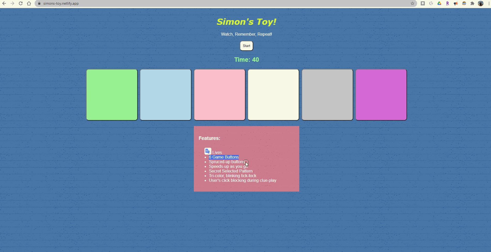

# Pre-work - _Memory Game_

**Memory Game** is a Light & Sound Memory game to apply for CodePath's SITE Program.

Submitted by: **Mehmet Fazil Kayadelen**

Time spent: **5** hours spent in total

Link to project: (insert your link here, should start with https://glitch.com...)

## Required Functionality

The following **required** functionality is complete:

- [x] Game interface has a heading (h1 tag), a line of body text (p tag), and four buttons that match the demo app
- [x] "Start" button toggles between "Start" and "Stop" when clicked.
- [x] Game buttons each light up and play a sound when clicked.
- [x] Computer plays back sequence of clues including sound and visual cue for each button
- [x] Play progresses to the next turn (the user gets the next step in the pattern) after a correct guess.
- [x] User wins the game after guessing a complete pattern
- [x] User loses the game after an incorrect guess

The following **optional** features are implemented:

- [x] Any HTML page elements (including game buttons) has been styled differently than in the tutorial
- [x] Buttons use a pitch (frequency) other than the ones in the tutorial
- [x] More than 4 functional game buttons
- [x] Playback speeds up on each turn
- [x] Computer picks a different pattern each time the game is played
- [x] Player only loses after 3 mistakes (instead of on the first mistake)
- [x] Game button appearance change goes beyond color (e.g. add an image)
- [ ] Game button sound is more complex than a single tone (e.g. an audio file, a chord, a sequence of multiple tones)
- [x] User has a limited amount of time to enter their guess on each turn

The following **additional** features are implemented:

- [x] List anything else that you can get done to improve the app!
- [x] Tri-colored, blinking timer when time is less than 20 seconds.
- [x] User's click is blocked during clue-play.
- [x] Mobile-view friendly.

## Video Walkthrough

Here's a walkthrough of implemented user stories:

- [x]  

## Reflection Questions

1. If you used any outside resources to help complete your submission (websites, books, people, etc) list them here.
   https://developer.mozilla.org
   https://www.w3schools.com/

2. What was a challenge you encountered in creating this submission (be specific)? How did you overcome it? (recommended 200 - 400 words)
   Firstly, I didn't spend much time creating the HTML and CSS because I had enough knowledge to do that. So, I think creating the algorithm is the most challenging part. I got stuck on the optional features such as giving the user three strikes and making the blinking timer. However, after I've written the pseudo-code on my actual notebook, I could see the order that my code was supposed to be. Then I typed it on my computer. More specifically, creating the blinking timer and the click-block during clue play consumed a decent amount of time. There was more than a way to have them work. I have created new variables and functions. Then I run for loops and DOM(Document Object Model) in there. I looked up some of the use of syntaxes in JavaScript from MDN(Mozilla Developer Network).

3. What questions about web development do you have after completing your submission? (recommended 100 - 300 words)
   I am wondering if I could make this website/web app work on an iPhone. Because I know how to make a responsive website a bit, and I made it work on mobile devices. It works ok on android (play-tone cuts too quick) but not at all on iPhone. Buttons don't pop-up back. So I'd like to make it work for all platforms, so all of the clients can access the website.

4. If you had a few more hours to work on this project, what would you spend them doing (for example: refactoring certain functions, adding additional features, etc). Be specific. (recommended 100 - 300 words)
   I would convert some of the DOM HTML collections to NodeLists. Because it becomes an array, so your code gets shorter while keeping the same efficiency. I also would like to work on audio clips to add them on the playing buttons. Finally, I would definitely make an input panel, so the user will be able to choose how many buttons to be there, how long the clue-play is. So, it will determine the hardness of the game.

## License

    Copyright Mehmet Fazil Kayadelen

    Licensed under the Apache License, Version 2.0 (the "License");
    you may not use this file except in compliance with the License.
    You may obtain a copy of the License at

        http://www.apache.org/licenses/LICENSE-2.0

    Unless required by applicable law or agreed to in writing, software
    distributed under the License is distributed on an "AS IS" BASIS,
    WITHOUT WARRANTIES OR CONDITIONS OF ANY KIND, either express or implied.
    See the License for the specific language governing permissions and
    limitations under the License.
